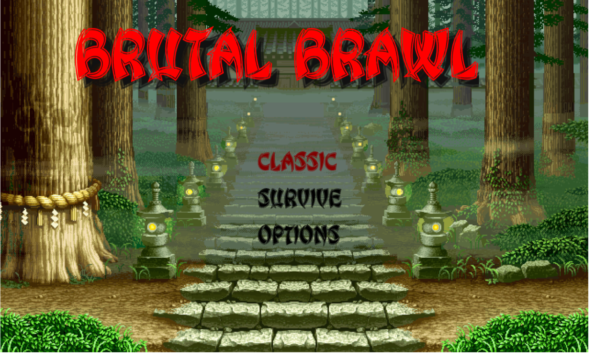

# Welcome to Brutal Brawl!

Brutal Brawl is a passion project deisgned to emulate Street Fighter using the Phaser 3 physics engine. It aims to copy the mechanics of Street Fighter while using two-dimensional spritesheets in order to provide fast-paced action.

The project uses a Phaser + EsBuild + TypeScript template, courtesy of Phaser. You can download the template [here](https://phaser.io/news/2024/02/phaser-esbuild-typescript-template).

Features of the template include:

1. Instant, automatic rebuilding of an app upon changes being made.
1. Quick transitioning from production to deployment
1. Type checking through TypeScript

## Running the game locally

In order to run the game locally, you'll first need to have [Node.js](https://nodejs.org) installed, which allows you to run scripts through `npm`.

Here is a basic list of commands that you can use npm for:
| Command | Description |
| --------------- | ---------------------------------------------- |
| `npm install` | Install project dependencies |
| `npm run dev` | Launch a development web server |
| `npm run build` | Create a production build in the `dist` folder |

To run the game, simply run the following commands in a terminal:

1. Run `npm install` in the root directory of the project
2. Run `npm run dev` to launch the web server
3. Navigate to `http://localhost:8080` in any web browser. Firefox or Google Chrome is recommended.

You can then edit any files under the `src` directory to see live changes happen in your browser.

## Template Project Structure

The project structure is as follows:

- `public/index.html` - A basic HTML page to contain the game.
- `src` - Contains the game source code.
- `src/main.ts` - The main entry point. This contains the game configuration and starts the game.
- `src/scenes/` - The Phaser Scenes are in this folder.
- `src/global.d.ts` - Global TypeScript declarations, provide types information.
- `public/style.css` - Some simple CSS rules to help with page layout.
- `public/assets` - Contains the static assets used by the game.

## Kanban Board

A Kanban Board listing all the To-Do tasks is here. Note that this is for my convenience, so that I can actually plan this out before diving in without a plan.

## Accessing the game:

To access the game, simply go [here](https://zkfazal.github.io/phaser-games/)

## Code and Other Stuff That Looks Useful

A list of potentially useful code will be dumped [here](references.html)
